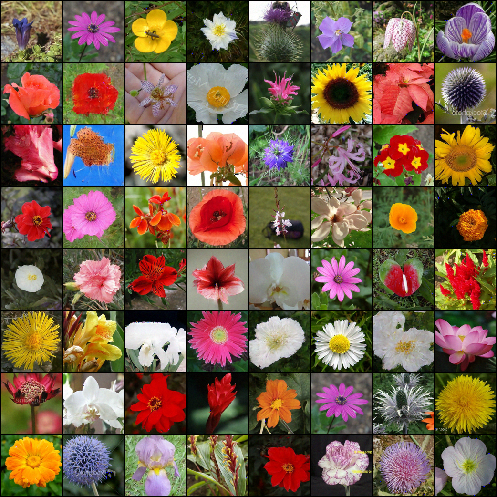
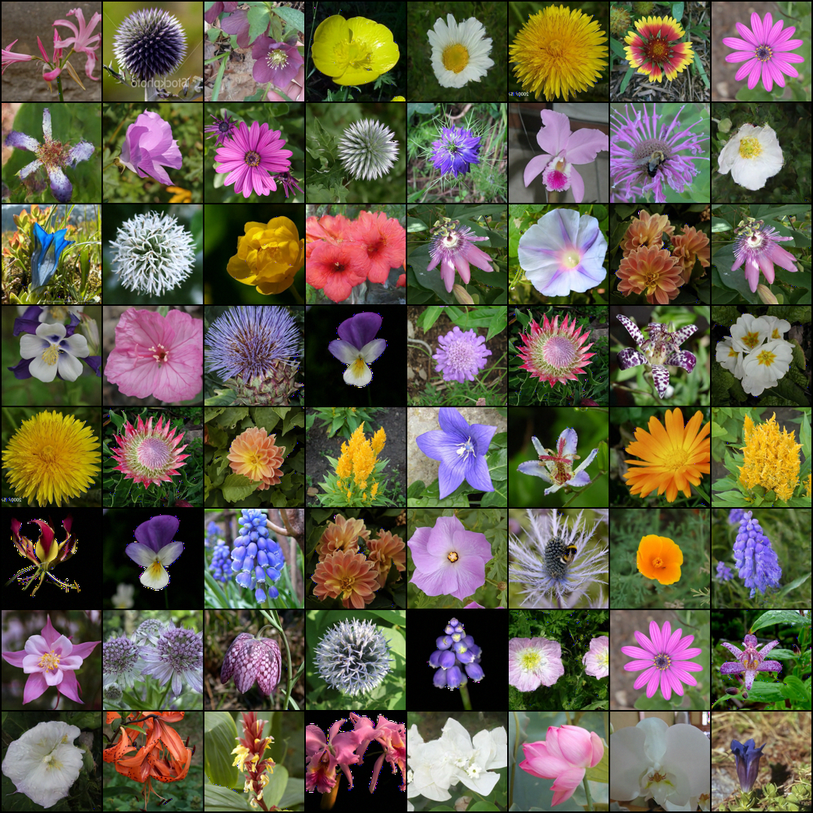

# Denoising Diffusion Probabilistic Model in Flax 

This implementation is based on [lucidrains](https://github.com/lucidrains)'s [denoising-diffusion-pytorch](https://github.com/lucidrains/denoising-diffusion-pytorch), where he implemented the original DDPM model proposed from paper [Denoising Diffusion Probabilistic Models](https://arxiv.org/abs/2006.11239), as well as latest research findings

I will keep adding new research findings to this repo, let me know if you have any suggestions! 

## end-to-end training on colab notebook 

[](https://github.com/yiyixuxu/denoising-diffusion-flax/blob/main/ddpm_flax_oxford102_end_to_end.ipynb)


You can run this code and even modify it directly in Google Colab, no installation required:

[https://github.com/yiyixuxu/denoising-diffusion-flax/blob/main/ddpm_flax_oxford102_end_to_end.ipynb]

The Colab also demonstrates how to configure your own training and load pre-trained checkpoint to generate samples on your own!

## generated sample from oxford102 flower dataset

*on going at 27k steps (self-conditioning + P2 weighting)*
</img>


*on going at 85k steps (self-conditioning + P2 weighting)*
</img>

*300k steps!*
</img>

## To-do list
- [ ] write a wandb report about the p2-weighting, self-conditioning and predict_from_x0 
- [ ] implement gradient accumulation
- [ ] implement ddim 

## Contents

- [Running locally](https://github.com/yiyixuxu/denoising-diffusion-flax/edit/main/README.md#running-locally) 
- [Using Google Cloud TPU](#google-cloud-tpu)
- [Examples](#examples)
- [pre-trained model](load-a-model-checkpoint-from-W&B)
- [Train your own model](#train-your-own-model)


### Running locally

```shell
python main.py --workdir=./fashion_mnist_cpu --mode=train --config=configs/fashion_mnist_cpu.py 
```


### Google Cloud TPU

If you're new to Jax/Flax ecosystem, you can apply to TPU for free for your research project here https://sites.research.google/trc/about/
(This project is enabled by TRC program. Thank you google!)  

See below for commands to set up a single VM with 8 TPUs attached
(`--accelerator-type v3-8`). For more details about how to set up and
use TPUs, refer to Cloud docs for
[single VM setup](https://cloud.google.com/tpu/docs/jax-quickstart-tpu-vm)(https://cloud.google.com/tpu/docs/jax-quickstart-tpu-vm).


First create a single TPUv3-8 VM and connect to it:

```
ZONE=europe-west4-a
TPU_TYPE=v3-8
VM_NAME=ddpm

gcloud alpha compute tpus tpu-vm create $VM_NAME \
    --zone $ZONE \
    --accelerator-type $TPU_TYPE \
    --version tpu-vm-base

gcloud alpha compute tpus tpu-vm ssh $VM_NAME --zone $ZONE -- \
```

When connected install JAX:

```
pip install "jax[tpu]>=0.2.16" -f https://storage.googleapis.com/jax-releases/libtpu_releases.html
```

Then install denoising-diffusion-flax and required libraries

```
git clone https://github.com/yiyixuxu/denoising-diffusion-flax.git
cd denoising-diffusion-flax/denoising_diffusion_flax
pip install einops
pip install wandb
pip install --upgrade clu
 ```

create a tmux session

```
tmux new -s ddpm
```

And finally start the training, to train a model on fashion-mnist dataset with default setting, run

```
python3 main.py --workdir=./fashion-mnist --mode=train --config=configs/fashion_mnist.py 
```

## Examples

All examples use read-to-use tensorflow dataset, and have the training process and model checkpoint available on W&B so it is very easy to reproduce

### cifar10

```
python3 main.py --workdir=./cifar10 --mode=train --config=configs/cifar10.py 
```

W&B project page: [ddpm-flax-cifar10](https://wandb.ai/yiyixu/ddpm-flax-cifar10?workspace=user-yiyixu)


### fashion-mnist

```
python3 main.py --workdir=./fashion-mnist --mode=train --config=configs/fashion_mnist.py 
```
W&B project page:  [ddpm-flax-fashion-mnist](https://wandb.ai/yiyixu/ddpm-flax-fashion-mnist?workspace=user-yiyixu)

### oxford_flowers102


```
python3 main.py --workdir=./flower102--mode=train --config=configs/oxford102_p2_selfcondition.py 
```

W&B project page: [ddpm-flax-flower102](https://wandb.ai/yiyixu/ddpm-flax-flower102?workspace=user-yiyixu)


## Load a model checkpoint from W&B

By default, we log our model as W&B artifact at end of the training, you can restore your checkpoint from wandb artifact directly by pass the `--wandb_artifact` argument on commend line; In the example below, we will load our model checkpint from the wandb artifact `yiyixu/ddpm-flax-fashion-mnist/model-3j8xvqwf:v0` and continue our training from there 

```
python main.py --workdir=./fashion_mnist_wandb --mode=train --wandb_artifact=yiyixu/ddpm-flax-fashion-mnist/model-3j8xvqwf:v0 --config=configs/fashion_mnist_cpu.py 
```


## Train your own model

You can customize your training either by __update the config file__ or __overriding parameters on the command line__

see more details on how to configure your training from the [notebook](https://github.com/yiyixuxu/denoising-diffusion-flax/blob/main/ddpm_flax_oxford102_end_to_end.ipynb)

[](https://github.com/yiyixuxu/denoising-diffusion-flax/blob/main/ddpm_flax_oxford102_end_to_end.ipynb)


#### Update the config file 

You can find example configuration files under `configs/` folder - you can create your own configuration file and run 

```
python3 main.py --workdir=./your_test_folder --mode=train --config=configs/your_config_file.py 
```


#### Overriding parameters on the command line

Specify a hyperparameter configuration by the means of setting `--config` flag.
Configuration flag is defined using
[config_flags](https://github.com/google/ml_collections/tree/master#config-flags).
`config_flags` allows overriding configuration fields. This can be done as
follows:

```shell
python main.py --workdir=./fashion_mnist_cpu --config=configs/fashion_mnist_cpu.py  \
--config.training.num_train_steps=100
```

### Configuration

### Dataset 

the script can run directly on any TensorFlow dataset, just set the configuration field `data.dataset` to the desired dataset name. You can find a list of ready-to-use dataset [here](tensorflow dataset name https://www.tensorflow.org/datasets/catalog/overview)

See below the list of hyperparameters for data processing; If you are using TPU with `8` devices, make sure your `batch_size` is dividable by `8`; If you set `data.image_size` to a different size than your actual image, it will be resized, so make sure to set the size properly

```
data.dataset           
data.batch_size              
data.cache                   
data.image_size
data.channels
```

### W&B Logging

It use Weights and Bias logging by default, if you don't already have an W&B acccount, you can sign up [here](https://wandb.ai/signup) - you will also be given option to create an account when you run the script on comand line 

To disable W&B logging, you can override with `--config` flag on command line

```
python3 main.py --workdir=./fashion-mnist --mode=train --config=configs/fashion_mnist.py --config.wandb.log_train=False
```

You can find below list of hyperparameters for W&B logging in config file

```
  wandb.entity = None
  wandb.project = "ddpm-flax-flower102"
  wandb.job_type = "training"
  wandb.name = None 
  wandb.log_train = True
  wandb.log_sample = True
  wandb.log_model = True
```

`wandb.entity`, `wandb.project`, `wandb.job_type` and `wandb.name` is used to initialize the wandb run; `wandb.project` is required field because we will create a project with that name to send the run to; all the other fields can be left as None

read more about how to set up these values in Weights & Biase documentation about `wandb.init()` [here](https://docs.wandb.ai/ref/python/init)

by default, we will log training metrics (`wandb.log_train = True`), generated samples (`wandb.log_sample = True`), as well as the final model checkpoint (`wandb.log_model = True`);


### Predict x0

By default, we train our model to predict noise by modifying its parameterization, if you want to predict `x_0` directly from `x_t`, set `config.ddpm.pred_x0=True`; 

The authors of DDPM paper claimed that they it lead to worse sample quality in their experiments 


### Self-Conditioning

Self-Conditioning is a useful technique for improving diffusion models. In a typical diffusion sampling process, the model iteratively predict `x0` in order to gradually denoise the image, and the `x0` estimated from previous step is discard in the new step; with self-conditioning, the model will also take previously generated samples as input.

You read more about the technique in the paper [Analog Bits: Generating Discrete Data using Diffusion Models with Self-Conditioning](https://arxiv.org/abs/2208.04202)

By default, we do not apply self-conditioning; If you wish to apply self-conditioning, set `config.ddpm.self_condition=True`;


### P2 Weighting

__P2 (perception prioritized) weighting__ optimizes the weighting scheme of the training objective function to improve sample quality. It encourages the diffusion model to focus on recovering signals from highly corrupted data, where the model learns global and perceptually rich concepts. 

You can read more about P2 weighting in the [paper](https://arxiv.org/abs/2204.00227) and check out the github [repo](https://github.com/jychoi118/P2-weighting)

By default, we do not apply P2 weighting. However you can apply it by change the values of p2 hyperparameters in config file, i.e. `config.ddpm.p2_loss_weight_gamma` and `config.ddpm.p2_loss_weight_k`; 

the paper recomend use `p2_loss_weight_gamma=1` and `p2_loss_weight_k=1`


### Model EMA 

By default, we will keep track of an exponential moving average version of the model and use it to generate samples. You can find the list of hyperparameters with default values for ema calculation in config file `config.ema`

```
  ema.beta = 0.995
  ema.update_every = 10
  ema.update_after_step = 100
  ema.inv_gamma = 1.0
  ema.power = 2 / 3
  ema.min_value = 0.0
```

`ema.inv_gamma` and `ema.power` is used to calculate `ema_decay` rate for each training step. i.e. `ema_decay = (1 + steps / config.inv_gamma) ** - config.power `; `ema.min_value` and `ema.beta` determine the minimum and maximum decay rate 

by default, we start to average the parameters after `100` steps (`ema.update_after_step = 100`) and we update the average every `10` steps (`ema.update_every = 10`) 


